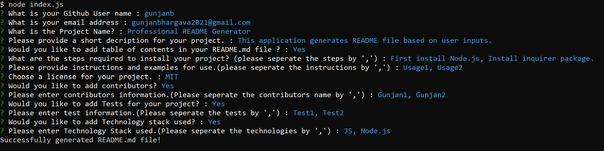

# Professional-README-Generator

## Description

This command-line application dynamically generates a professional README file from a user's input.This allows the project creator to devote more time to work on the project and having a high quality README file for a project increases the likelihood that other developers will contribute to the success of the project.
In this application user is asked a series of questions which includes whats your github profile name, emailID, project name and a short description for project. User is also asked whether they would like to add table of contents in README. User is asked for steps of installation, Usage info and license for project. User asked whether they would like to add contributors, tests and technologies used for project and if choose yes then user is presented with next set of question asking contributors name , test information and technology names respectively.User is asked to feed multiline informations seperated by comma.

## Key Learning:

1. Javascript.
2. Template literals.
3. Node.js
4. NPM Inquirer Package
5. Usage of Github (uploading and publishing on github).

## Table of Contents

- [Installation](#Installation)
- [Usage](#Usage)
- [License](#License)
- [Contributors](#Contributors)
- [Tests](#Tests)
- [Technologies](#Technologies)
- [Questions](#Questions)

## Installation

- Clone repo.
- On console run npm install.
- Run the command node index.js
- Required README file will be genetrated under generatedREADME folder

## Usage

- Console ScreenShot

  

- Video link

  [Watch Video here](https://drive.google.com/file/d/1uDdgXtsE7DYf_5vnGA2TK21qstSY4t-H/view)

## License

- The application is covered under the license MIT. For more Info please visit [License Info](https://opensource.org/licenses/MIT)

## Contributors

- None

## Tests

- None

## Technologies

- JavaScript
- Node.js
- [NPM Inquirer Package](https://www.npmjs.com/package/inquirer)
- [NPM FS Package](https://www.npmjs.com/package/fs)

## Questions

If you have any questions about project you can either contact me or visit my github profile.

Link to my Github: [My_GitHub_Profile](https://github.com/gunjanb)

Email address :[gunjanbhargava2021@gmail.com](mailto:gunjanbhargava2021@gmail.com)
